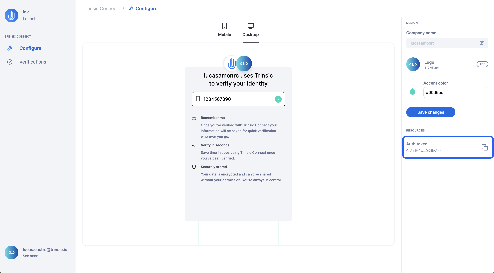

# Getting Started with Trinsic Connect

The future of identity lies in reusability, and Trinsic Connect paves the way for a superior user experience by simplifying identity verification. This guide will lead you through the essential steps to embark on your Trinsic Connect journey – from configuring settings and obtaining an authentication token to integrating with the SDK and visualizing recent verifications.

This guide adopts the perspective of a _relying party_ – an entity responsible for verifying its users, such as banks, employers, and marketplaces. If you are an _attestation provider_ (identity verification company), please reach out to Trinsic support for specialized guidance.

---

## Join the Trinsic Connect Beta Program

Trinsic Connect stands as a reusable Identity Verification platform, minimizing user friction by securely reusing previous identity verification results. Please note that Trinsic Connect is currently in a closed beta. To gain early access, [contact us](mailto:contact@trinsic.id). We will help you get setup with the right roles so that you can access the following steps.

## Get Your Auth Token

Before you can seamlessly integrate verification flows into your application, you must obtain and securely store your authentication token. Follow these steps:

1. Visit [idv.connect.trinsic.cloud](https://idv.connect.trinsic.cloud/).
2. Sign in using the email address provided during your beta program sign up.
3. In the **Configure** page (under the Trinsic Connect section), locate the sidebar on the right-hand side of the screen.
4. Under the resources section, find “Auth Token”.
5. Click anywhere in that row to copy your authentication token to your clipboard.



Now armed with the auth token, you are ready to start integrating with our SDK and building your verification flow.

## Customize Your Brand

Easily personalize your organization's branding on the same page where you obtained your authentication token. Follow these steps to create a unique and recognizable identity for your users:

1. Visit [idv.connect.trinsic.cloud/wallet/relying-party/configure](https://idv.connect.trinsic.cloud/wallet/relying-party-configure).
2. Once on the **Configure** page, locate the design settings on the right-hand side of the screen.

Your branding options include:

-   **Company name:** The name of your organization for user recognition during verification.
-   **Logo:** An image file of your company’s logo (recommended size: at least 512x512px for better quality).
-   **Accent color:** The color associated with your brand to be used during the verification flow.

After customizing your brand, click the “Save changes” button to update the preview. Congratulations! You have successfully tailored your brand for a distinct and engaging user experience. Now, you are ready to integrate with the SDK.

## **Integrate with the SDK**

Building a verification flow using Trinsic Connect involves two parts: the server and the client (UI). These would be the steps if you were using Node.js with Express, for example.

1. On your server side, instantiate the Trinsic Connect service through the SDK by providing your account’s authentication token.

    ```tsx
    // On your server-side code.
    import { TrinsicService, VerificationType } from "@trinsic/trinsic";

    const authToken = "<AUTH_TOKEN>";

    const trinsic = new TrinsicService({ authToken });
    ```

2. On your server side, set up an endpoint to create a new session. This endpoint creates a new IDV session with the SDK whenever called and returns it to the client.

    ```tsx
    const app = express();

    app.post("/api/create-session", async (req, res) => {
        const createSessionResponse = await trinsic.connect().createSession({
            verifications: [{ type: VerificationType.GOVERNMENT_ID }],
        });

        return res.json(createSessionResponse.session);
    });
    ```

3. On your server side, set up an endpoint to retrieve an IDV session using the SDK. The client will need to supply the ID of the specific IDV session.

    ```tsx
    app.get("/api/get-session/:sessionId", async (req, res) => {
        const getSessionResponse = await trinsic.connect().getSession({
            idvSessionId: req.params.sessionId,
        });

        return res.json(getSessionResponse);
    });
    ```

4. On your client side, add the following script tag to your HTML document: **`<script src="https://unpkg.com/@trinsic/trinsic@1.13.0/dist/trinsic.min.js" defer />`**

5. On your client side, add the following event handler and attach it to a trigger element:

    ```jsx
    const verifyButton = document.getElementById("verifyButton");

    verifyButton.addEventListener("click", async () => {
        // Instantiate a new ConnectClient using the package from step 4
        const { ConnectClient } = trinsic;
        const client = new ConnectClient();

        // Create a valid IDV session by calling the endpoint from step 2
        const createSessionResponse = await fetch("/api/create-session", {
            method: "POST",
        });
        const session = await createSessionResponse.json();

        // Start the verification by providing the IDV session client token
        const idv = await client.identityVerification(session.clientToken);
        console.log(await idv.json());

        // Retrieve the results by calling the endpoint from step 3
        const getSessionResponse = await fetch(
            `/api/get-session/${session.id}`
        );
        const idvResult = await getSessionResponse.json();

        console.log(idvResult);
    });
    ```

For more details on each step, refer to the following resources:

-   [Request identity document verification in browser](https://docs.trinsic.id/examples/idv-browser/)
-   [Sample repository for requesting identity verification in the browser](https://github.com/trinsic-id/sdk/tree/main/examples/idv-browser)
-   [ConnectService API reference page](https://docs.trinsic.id/reference/services/connect-service/)

## Visualize Your Verifications

The final piece of information to share is the **[Verifications](https://idv.connect.trinsic.cloud/wallet/relying-party/verifications)** page in your Connect Studio. As you perform verifications by creating new IDV sessions, the table in the verifications page will start to populate.

This page provides an overview of past verifications, including their status, the requested document fields, and initiation/update timestamps.


---

## **Conclusion**

Congratulations on completing the guide to getting started with Trinsic Connect! You have now established the groundwork for a seamless and user-friendly identity verification experience in your product.

As you incorporate Trinsic Connect into your application, embrace the future of identity reusability and provide your users with a secure, efficient, and personalized verification experience. If you encounter any challenges or have specific queries, don't hesitate to reach out to Trinsic support for assistance.

Thank you for choosing Trinsic Connect. Happy verifying!
