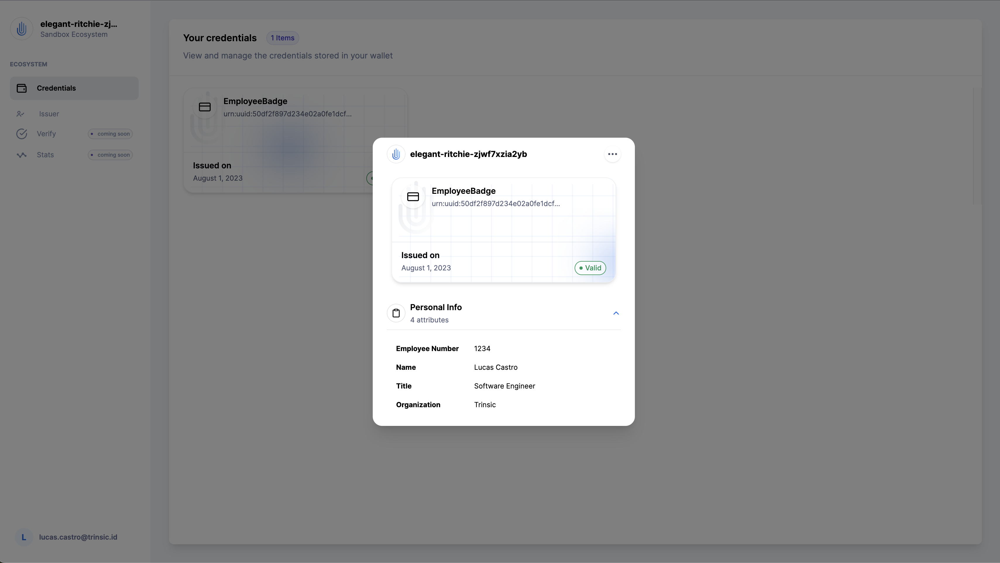

# Platform Walkthrough

If you're looking to harness the power of verifiable credentials and streamline your reusable identity use-case, you've come to the right place. In this comprehensive tutorial, we will walk you through the steps to get started with Trinsic's Dashboard and White Label Wallet products, enabling you to issue, manage, and verify credentials seamlessly.

This tutorial will teach you how set up a basic verifiable credential ecosystem, define credential templates, assign credential issuers, issue a verifiable credential, manage verifiable credentials in a personal wallet, and verify a credential with Trinsic. There are instructions in text and video.

For the purposes of this tutorial we will be dealing with the use-case of an *employee badge*, but feel free to try different things as you follow along.

---

## Create an Ecosystem

An ecosystem is a set of entities that can interact with a user's identity through a digital identity wallet. It typically includes an IDtech provider, issuers who transform raw data into verifiable credentials, holders who control their own identity, and verifiers who can trust credentials without maintaining their infrastructure by relying on trusted issuers within the ecosystem.

!!! info "Learn More"
    To learn more about ecosystems, see our documentation on [ecosystems](https://docs.trinsic.id/learn/concepts/ecosystems/)

When you were first onboarded on Trinsic Dashboard you were prompted to create an ecosystem. For the purposes of this tutorial we will create a new one.

**Steps**

1. Go to the [Trinsic Dashboard](https://dashboard.trinsic.id/) and log in.
2. Click on the vertical three dots (by your ecosystem name at the top of the navigation menu).
3. You should see a dropdown menu with a list of the ecosystems you are member of. Click on *Add Ecosystem*
4. Select your ecosystem plan and click on the respective *Continue with…* button (the free plan is sufficient for this tutorial).
5. You will be taken through the ecosystem onboarding at this point. Feel free to read through it or skip it for now.

<iframe src="https://www.loom.com/embed/bdc20ea66d2c434a83c1a9e83e430fd0?sid=7c1d8579-84df-478c-9cb2-aaa7c9deadea" frameborder="0" webkitallowfullscreen mozallowfullscreen allowfullscreen style="position: absolute; top: 0; left: 0; width: 100%; height: 100%;"></iframe>

---

## Access the White Label Wallet

Trinsic leverages cloud wallets to help you manage verifiable credentials. The White Label Wallet allows identity holders to easily access and manage the credentials that have been issued to them, and issuers have a centralized portal where they can quickly issue a credential from templates they have been assigned to.

!!! info "Learn More"
    To learn more about how wallets work, see our documentation page on [Wallets](https://docs.trinsic.id/learn/concepts/wallets/).

The White Label Wallet experience is tailored to your ecosystem branding that can be configured in the [Settings > Branding](https://dashboard.trinsic.id/ecosystem/settings/domain) page in the dashboard.

Watch the video below for a good overview on how to use your White Label Wallet. We then proceed to issue your first verifiable credential.

<iframe src="https://www.youtube.com/embed/GfNJgkGn_8Q" frameborder="0" webkitallowfullscreen mozallowfullscreen allowfullscreen style="position: absolute; top: 0; left: 0; width: 100%; height: 100%;"></iframe>

---

## Create a Verifiable Credential Template

Credential templates (i.e., schemas) allow providers to specify the formats and types of verifiable credentials issued to the ecosystem’s identity holders. They serve as an abstraction that simplifies initial setup.

In our use-case of *employee badges*, employees will receive their badge in a digital format as a verifiable credential. Our ecosystem needs to define a credential before issuers are able to issue the employee badges.

!!! info "Learn More"
    To learn more about credential templates or verifiable credentials, see our documentation on [templates](https://docs.trinsic.id/learn/concepts/templates/) and [credentials](https://docs.trinsic.id/learn/concepts/credentials/).

### Create the *Employee Badge* template

You can create credential templates with Trinsic using the Dashboard or the SDK. In this tutorial we will show you how you can do that in the Dashboard.

**Steps**

1. Go to the [Trinsic Dashboard](https://dashboard.trinsic.id/) home.
2. In the navigation menu, click on *Templates* and select *Credential Templates.*
3. On the top-right corner, click on the *Create a template* button.

<iframe src="https://www.loom.com/embed/3ec02b6241da45fb95e23d3de07e4c68?sid=02079c42-e228-4cde-8a47-a7d45ae1e471" frameborder="0" webkitallowfullscreen mozallowfullscreen allowfullscreen style="position: absolute; top: 0; left: 0; width: 100%; height: 100%;"></iframe>

### Fill the *Create new template* form

In this tutorial we will create a credential template that will have the shape below, but feel free to explore the different options in the form and add as many sections as you’d like.

**Employee badge template**

- **Template Name**: Employee Badge
- **Template Description**: A simple employee badge credential used to gain access to the office building.
- **Section name:** Personal Info

    | Name | Type | Display Name | Description |
    | --- | --- | --- | --- |
    | `employeeNo` | `Number` | Employee Number | Employee’s number |
    | `fullName` | `String` | Name | Employee’s full name |
    | `jobTitle` | `String` | Title | Employee’s title |
    | `org` | `String` | Organization | Employee’s org |

Make sure to leave the *Allow extra attributes checkbox unchecked* and press the *Create template* button.

You will be taken back to the Credential Templates page and you will see your new credential template in the table. Congratulations!

Notice how it says *No Issuers.* You can still issue a credential even without issuers registered but the issued credential will be considered invalid though. You will register youself as an issuer in the next section.

---

## Register an Issuer

Issuers are the source of data in an ecosystem. They transform their raw data into verifiable credentials using templates. In a Trinsic ecosystem, an issuer must posses a wallet; therefore, and issuer can also assume the role of a holder. We assign issuers in an ecosystem by first making sure they posses a holder wallet and then registering their identity as an issuer to a particular credential template.

!!! info "Learn More"
    To learn more about issuers and governance frameworks, see our documentation on [Issuer](https://docs.trinsic.id/learn/concepts/ecosystems/#anatomy-of-a-trust-ecosystem) and [Governance](https://docs.trinsic.id/learn/concepts/trust-registries/).

For the purposes of this tutorial you will assign yourself as an issuer, but if you would like to assign someone else make sure that a wallet is created for them in the [Participants > Wallets](https://dev-dashboard.trinsic.id/ecosystem/provider/wallets) page in the dashboard.

**Steps**

1. Go to the [Credential Templates](https://dashboard.trinsic.id/ecosystem/templates) pages in the dashboard.
2. Find the row with the *EmployeeBadge* credential template and click on the *Edit* button at the end of the row.
3. In the *Register issuer by email* field type in your email address associated with your wallet.
4. Click on the *Add issuer* button

<iframe src="https://www.loom.com/embed/f8ff4b0406584398991b876744d200a2?sid=f4ca3c0c-c8ab-40e7-ab79-274dbae52edb" frameborder="0" webkitallowfullscreen mozallowfullscreen allowfullscreen style="position: absolute; top: 0; left: 0; width: 100%; height: 100%;"></iframe>

Done. Easy as that you registered yourself as an issuer authorized to issue the *EmployeeBadge* credential in your ecosystem. You can see a list of all the registered issuers in your ecosystem in the [Participants > Issuers](https://dashboard.trinsic.id/ecosystem/provider/issuers) page in the dashboard.

---

## Issue a Credential

After registering yourself as an issuer, you should have received an email notifying that you are an approved issuer of the *EmployeeBadge* credential in your ecosystem. The email contains a link that you can use to start issuing credentials in the White Label Wallet. Clicking that link will take you to the issuer portal in the White Label Wallet and open up the issuance form.

Follow the steps below to issue your first credential.

**Steps**

1. Go to your White Label Wallet and log in: `<your-ecosystem-name>.connect.trinsic.cloud`.
2. In the navigation menu, click on *Issuer* and select *Issue Credential*
3. In the Issuer portal page you will see a card for each credential template you have been assigned as an issuer. Click the card for your Employee Badge credential.
4. Type the holder’s email address in the *Recipient email* field (your email in this case).
5. Fill the remaining of the form with the desired credential data and click on the *Issue directly* button.

<iframe src="https://www.loom.com/embed/aa8cb10d7a0746ada2cf5f5160e1fe53?sid=e23bd0f7-5517-440f-aa1b-229c1861675a" frameborder="0" webkitallowfullscreen mozallowfullscreen allowfullscreen style="position: absolute; top: 0; left: 0; width: 100%; height: 100%;"></iframe>

Congratulations! You have issued your first verifiable credential.

---

## Manage your Credential

After issuing the credential to yourself, you will receive a notification in your email with a link to visualize your credential in the White Label Wallet. Clicking that link will take you to your credential details view as shown below:

You can see all of the credentials you hold in the *Credentials* page of your White Label Wallet. You will also be able to export your credential as a `JSON` file, delete the credential, and add the verifiable credential pass to your Google or Apple wallet (if your ecosystem has these features enabled.)

### Add your Verifiable Credential to your Google or Apple Wallet

Ecosystems on the Build or Launch plans can enable their holders to add their verifiable credentials to their mobile wallets as verifiable credential passes for quick validation flows. The video below shows how that works.

<iframe src="https://www.loom.com/embed/5fffdd04fe594f6d9b37f865dd9a0c56?sid=94cc8fb8-9762-422b-9476-9e558ca6cfec" frameborder="0" webkitallowfullscreen mozallowfullscreen allowfullscreen style="position: absolute; top: 0; left: 0; width: 100%; height: 100%;"></iframe>

### Delete your Credential

We offer you the ability to delete your verifiable credential. This action is irreversible and will render your credential unusable if you exported it.

!!! warning "Disclaimer"
    We included this section for your information, and we don’t expect you to follow the steps below. You can skip to the next section.

**Steps**

1. Select your credential in the *Credentials* page in the White Label Wallet.
2. Click on the three dots at the top of the credential details view
3. Click *Delete Credential* option.
4. Follow the prompts

<iframe src="https://www.loom.com/embed/17c16e6fb0e54bf597bb137ec9fc6297?sid=80da875d-ce49-472c-9b77-2377715d32f5" frameborder="0" webkitallowfullscreen mozallowfullscreen allowfullscreen style="position: absolute; top: 0; left: 0; width: 100%; height: 100%;"></iframe>

---

## Verify your Credential

Up until this point we walked you through a working demo you can safely employ in production. The philosophy behind the white-label wallet and the issuer portal is to keep you from reinventing the wheel when it comes to your use-case.

This next step is purely for demonstration purposes and does not represent a real use-case of a verification flow. We expect you as a provider to leverage Trinsic’s tools and SDK to build your verification strategies in partnership with your verifiers.

Since in this example we don’t have a verifier portal built, we can use the Dashboard verify function as a proof of concept and demonstration that your newly issued credential is indeed valid and belongs to you.

!!! info "Learn More"
    To learn more about verifications, see our documentation page on [Verifications](https://docs.trinsic.id/learn/concepts/verifications/).

**Steps**

1. Go to the [Credential Templates](https://dashboard.trinsic.id/ecosystem/templates) pages in the Dashboard.
2. Find the row with the *EmployeeBadge* credential template and click on the *Verify* button at the end of the row.
3. A popup will open. Log in to the OIDC service if prompted, and follow the steps until you reach the presentation page.
4. In the presentation screen, mark the attributes you wish to disclose (e.g., Employee Number, Name, etc.)
5. Once you are done marking the attributes, click on the *Verify* button

<iframe src="https://www.loom.com/embed/4f1badd95dd34f85b86e9b846d822282?sid=be345f17-78bf-419d-ade0-1d3547dbd246" frameborder="0" webkitallowfullscreen mozallowfullscreen allowfullscreen style="position: absolute; top: 0; left: 0; width: 100%; height: 100%;"></iframe>

If everything worked out, the pop up window should close and you will be back to the dashboard where you will notice a new modal showed up with the `JSON` view of your verifiable credential.

Notice how in the `profile.credentialSubject` field only the attributes that you disclosed on step four are included. Additionally, the cryptographic proof of your credential can be found in the `profile.proof` field.

---

## Conclusion

Congratulations! If you've gotten this far, you've now used the Trinsic Dashboard and White Label Wallet to issue and verify information with a verifiable credential.

You’ve learned how to set up a quick demo using the White-label wallet and the Issuer Portal in the White Label Wallet and got your feet wet with verifications using the Dashboard.

There is much more you can do with Trinsic.

- You can create [Verification Templates](https://dashboard.trinsic.id/ecosystem/verifications)
- Integrate other [authentication methods](https://dashboard.trinsic.id/ecosystem/settings/authentication) in the White Label Wallet
- Build your identity product with one of our [SDKs](https://docs.trinsic.id/sdk/)
- Join our [developer community](https://join.slack.com/t/trinsiccommunity/shared_invite/zt-pcsdy7kn-h4vtdPEpqQUlmirU8FFzSQ)

Whatever you choose to do next, we are so excited to build the future of identity with you.
