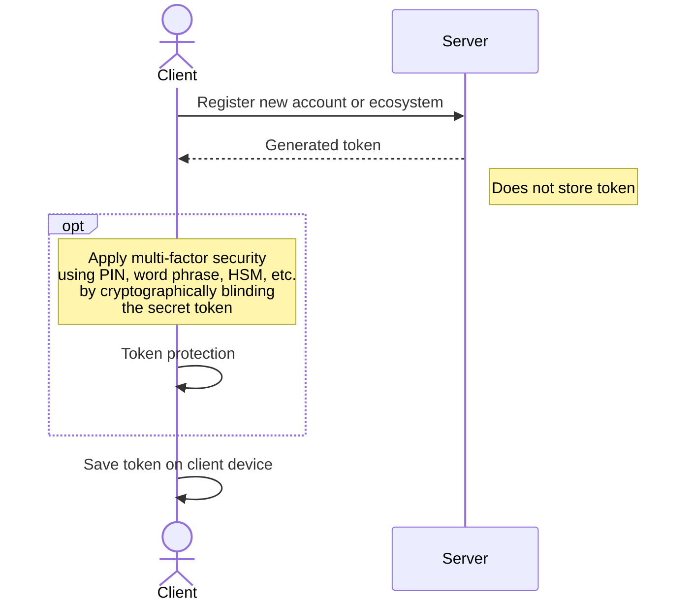
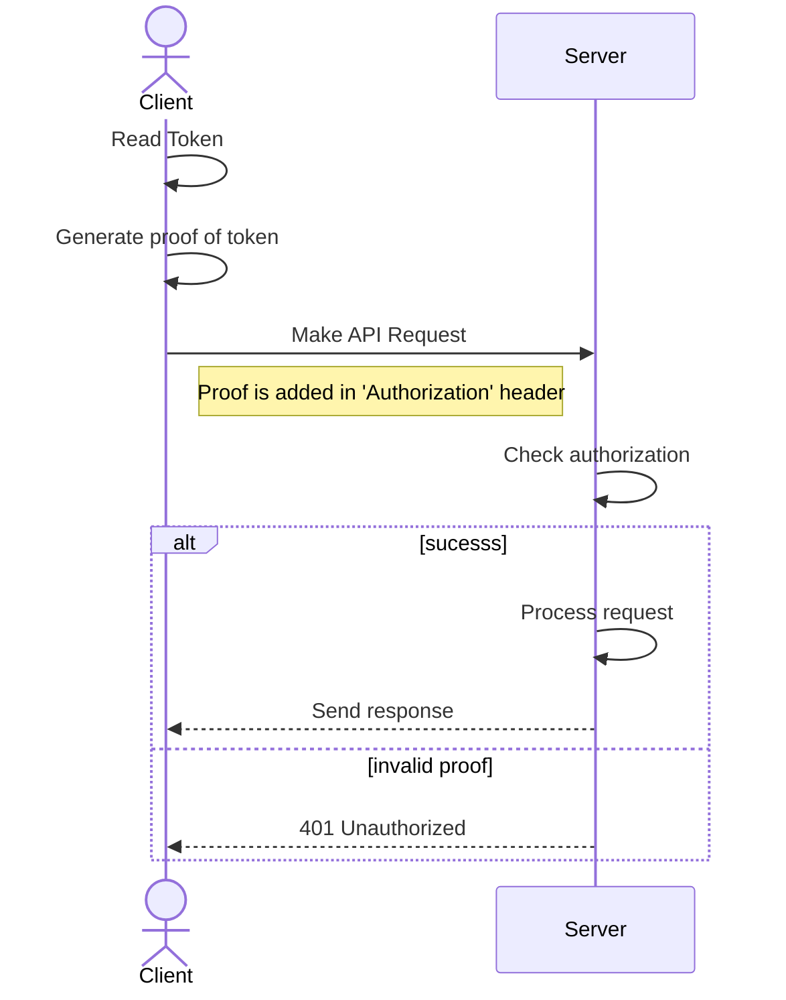

# Security Infrastructure

## Overview

Our cloud services are secured using a novel method of authentication based on [zero-knowledge proofs <small>:material-open-in-new:</small>](https://en.wikipedia.org/wiki/Zero-knowledge_proof){target=_blank}. This approach allows us to introduce passwordless client authentication with improved security and user experience.

Compared to traditional security methods that store users' credentials on the server, our approach relies on a one-time client/server negotiation without storing any user secrets on our servers. All secrets are stored with the user client and are entirely in their control. During authentication, users present proof of knowledge of these secret tokens, instead of the actual tokens. This proof is generated with each request and is unique for that request only.

## Oberon Auth Scheme

A succinct ZKP protocol for authentication. It works by using techniques similar to Identity-Based/Attribute-Based signatures.

Oberon allows endpoints to issue multi-factor capable tokens to consumers who can prove their validity without disclosing the tokens themselves and without requiring email, SMS, or authenticator apps. Endpoints only need to store a single public key and not any tokens. An attacker that breaks into the server doesn't have any password/token files to steal and only would see a public key. The proof of token validity is only 256 bytes while the token itself is only 48 bytes. The issuing party and verifying servers can be separate entities.

[Crypto details for Oberon <small>:material-open-in-new:</small>](https://github.com/mikelodder7/oberon/blob/main/CRYPTO.md){target=_blank}

### Account Registration

The below diagram illustrates how client and server interact during the registration process and negotiate the data for authentication:

### API Requests

The process of making authenticated API requests against the server involves generating a proof of knowledge and appending it to the request headers. This proof is:

- valid for a limited time only (order of milliseconds)
- unique and cannot be used twice (replay protection)
- bound to the current request payload (mitm protection)

The diagram below illustrates the steps involved in generating proof and interacting with the server.

