In this session, we’ll walk through how to have an interactive experience with the Trinsic API. By following the steps below, you’ll be able to experiment quicker, experience our API’s functionality, and understand how Trinsic Ecosystem works without having to setup any project environment. We’ll teach you how to use two different tools — [Postman](https://www.postman.com/) and [Buf Studio](https://docs.buf.build/bsr/studio) — which both have an interactive UI for calling the API.

But before we make any API calls, the tools mentioned above require you to have an authorization token. You cannot use your authorization token from the Dashboard directly in the API as it is not meant to be transmitted directly with each call. Instead, you should use the token through the SDK, and it will calculate a derivation of your token that you can use. (We use zero-knowledge proofs (ZKPs) to do so—you can learn more in our [documentation](https://docs.trinsic.id/learn/platform/security/#oberon-auth-scheme)).

Let’s get started with our step-by-step tutorial below.

##How to get the token for authentication
To get the token for authentication, you’ll need to make API calls. Follow these steps:

1. [Get the Trinsic CLI](https://docs.trinsic.id/cli/) and ensure it’s properly installed by running `trinsic` from the command line.
2. Go to your [Trinsic Ecosystem Dashboard](https://dashboard.trinsic.id/ecosystem).
3. Click **View API Token** and copy your token.

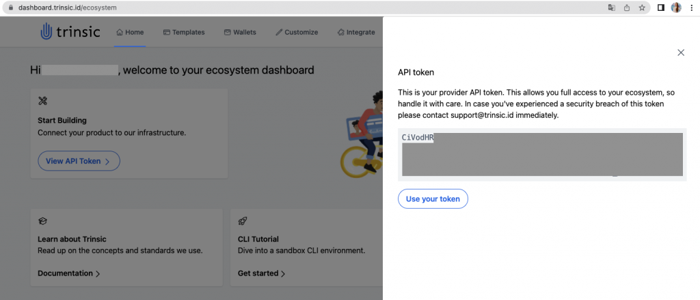

4. Run `trinsic config -a <token>`. This will set your token in the config file.

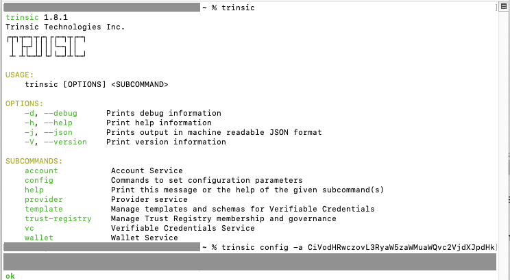

5. Run `trinsic config` and make sure your token is set correctly and your server endpoint is set to `prod.trinsic.cloud`.
6. Run `trinsic account info` and see if the information matches the ones from your account.
7. Run `trinsic —-debug account info` and copy the pink text after *DEBUG: Authorization*. This is the ZKP token for authentication you will use with your calls.

*Please note this is a lot longer than in the below screenshot.*

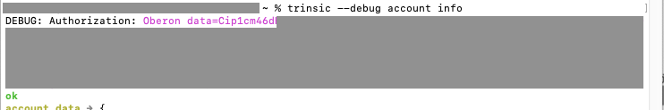

##Postman
###Configuring Postman
To configure Postman, follow these steps:

1. [Download Postman](https://www.postman.com/downloads/) and create an account/log in.
2. Click **New > gRPC Request**.

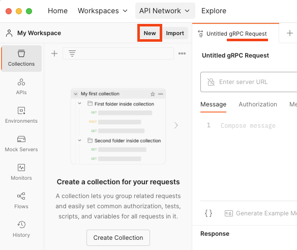

3. In the field **Enter server URL**, add [prod.trinsic.cloud:443](http://prod.trinsic.cloud:443/) and click the padlock to enable TLS.
4. In the tab *Metadata*, add **Authorization** in the *Key* field and your token (the one you generated above) in the *Value* field.
5. Your page should look like this:

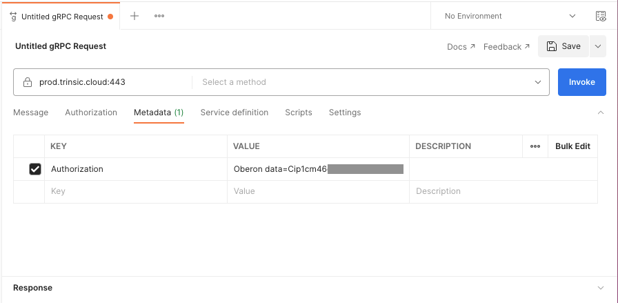

6. In Postman, you can save these configurations by clicking on the dropdown next to **Save** and saving the request inside a Collection.

###Making API Calls
With your Postman configured, you can now test all API calls from Trinsic’s API.

If you click **Select a method**, you’ll see all available methods.

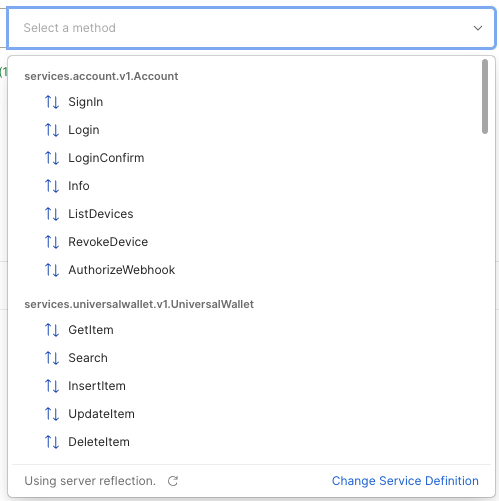

Try selecting the option **Info** and click **Invoke**. You should see something like this:

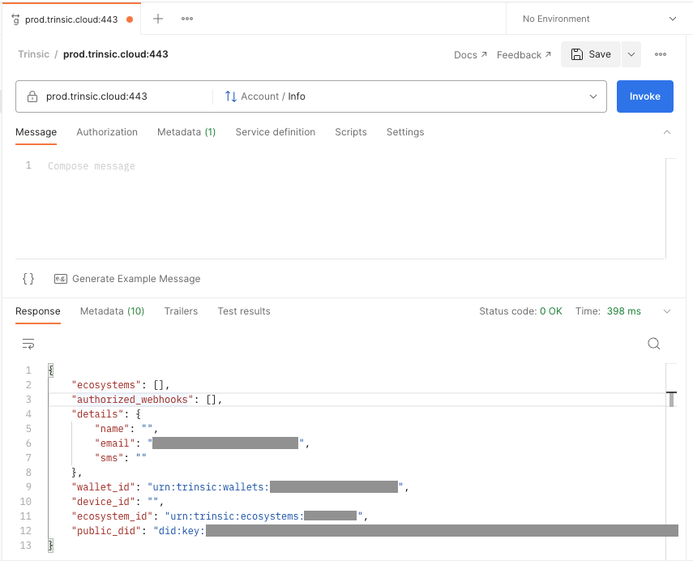

If you run the *CredentialTemplates/List* method, you should see all your Credential Templates listed in the Response:

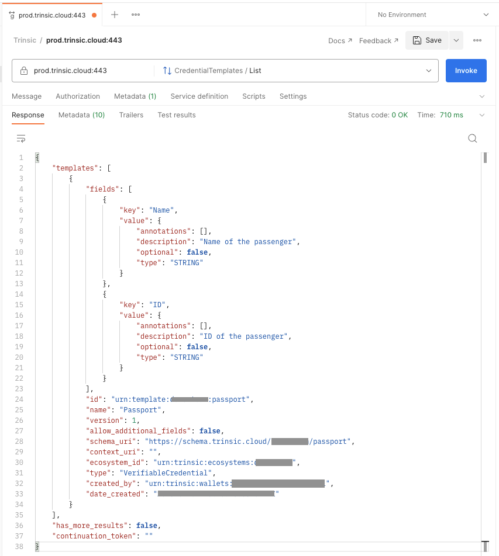

Whenever you call any method, if you have any doubts regarding the fields that appear in the body of the call when you click **Generate Example Message** (what they should be and if they’re required or not), just consult the [Reference tab of our documentation](https://docs.trinsic.id/reference/).

###Issuing a Credential
Copy the *id* value from one of your Credential Templates, and issue a credential from it following the next steps:

1. Select the method *VerifiableCredential/IssueFromTemplate*.
2. Click on **Generate Example Message**.
3. Clear/delete the field `framework_id`.
4. Paste the template id in the `template_id` field.
5. Populate the field `values_json` with the information required by your credential template. Remember to use the character `\` before all double quotes.
6. Click on **Invoke**.

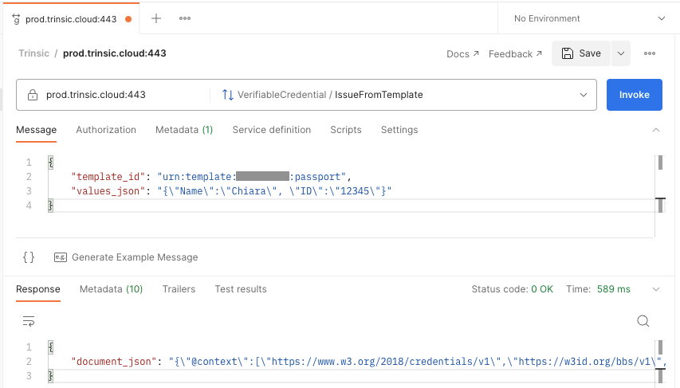

You just issued a credential from your credential template! 😄

###Using Queries
You can use queries to make searches or get, insert, and update wallets. See the example below:

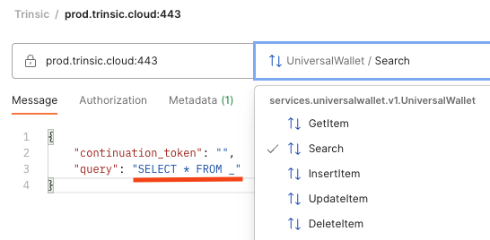

Make sure to explore all the methods provided by the Trinsic API! 🤩

##Buf Studio
###Configuring Buf Studio
To configure your Buf Studio, follow these steps:

1. Access [Trinsic Services inside Buf Studio](https://studio.buf.build/trinsic/services).
2. In the *Target* field, paste the following URL: [https://prod.trinsic.cloud:443](https://prod.trinsic.cloud/)
3. In the tab *Headers*, add **Authorization** in the *Key* field and your token (the one you generated above) in the *Value* field.
4. Click **gRPC-web** at the end of the page.
5. Your page should look like this:

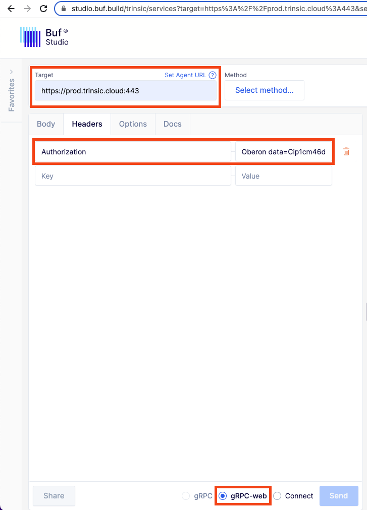

###Making API Calls
With your Buf Studio configured, you can now test all API calls from Trinsic’s API.

If you click **Select method**, you’ll see all available methods.

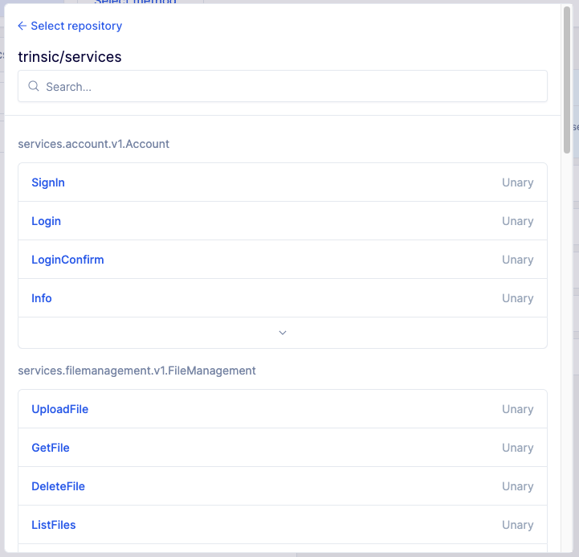

Try selecting the option **Info** and click **Send**. You should see something like this:

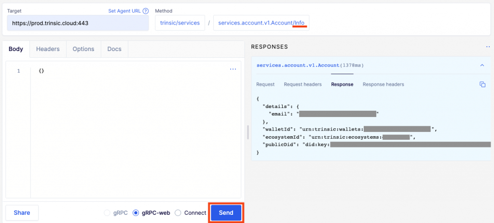

If you run the *CredentialTemplates/List* method, you should see all your Credential Templates listed in the Response:

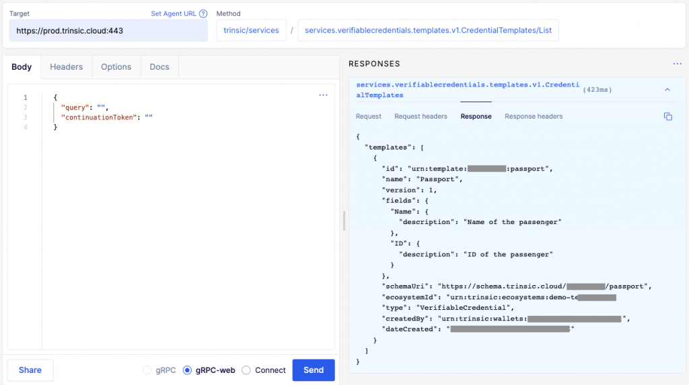

Whenever you call any method, if you have any doubts regarding the fields that appear in the body of the call (what they should be and if they’re required or not), just consult the [Reference tab of our documentation](https://docs.trinsic.id/reference/).

###Issuing a Credential
Copy the **id** value from one of your Credential Templates and issue a credential from it following the next steps:

1. Select the method *VerifiableCredential/IssueFromTemplate*.
2. Paste the template id in the `templateId` field.
3. Populate the field `valuesJson` with the information required by your credential template. Remember to use the character `\` before all double quotes.
4. Click on **Send**.

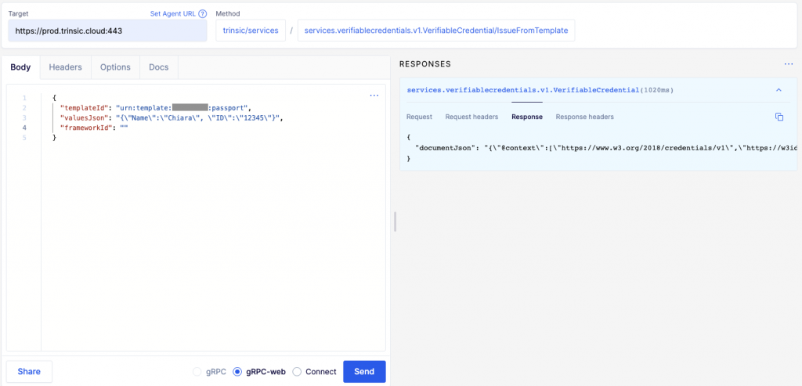

You just issued a credential from your credential template! 😄

###Using Queries
You can use queries to make searches or get, insert, and update wallets. See the example below:

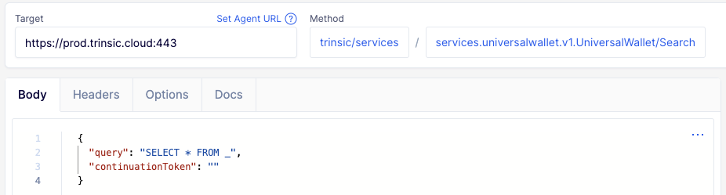

Make sure to explore all the methods provided by the Trinsic API! 🤩