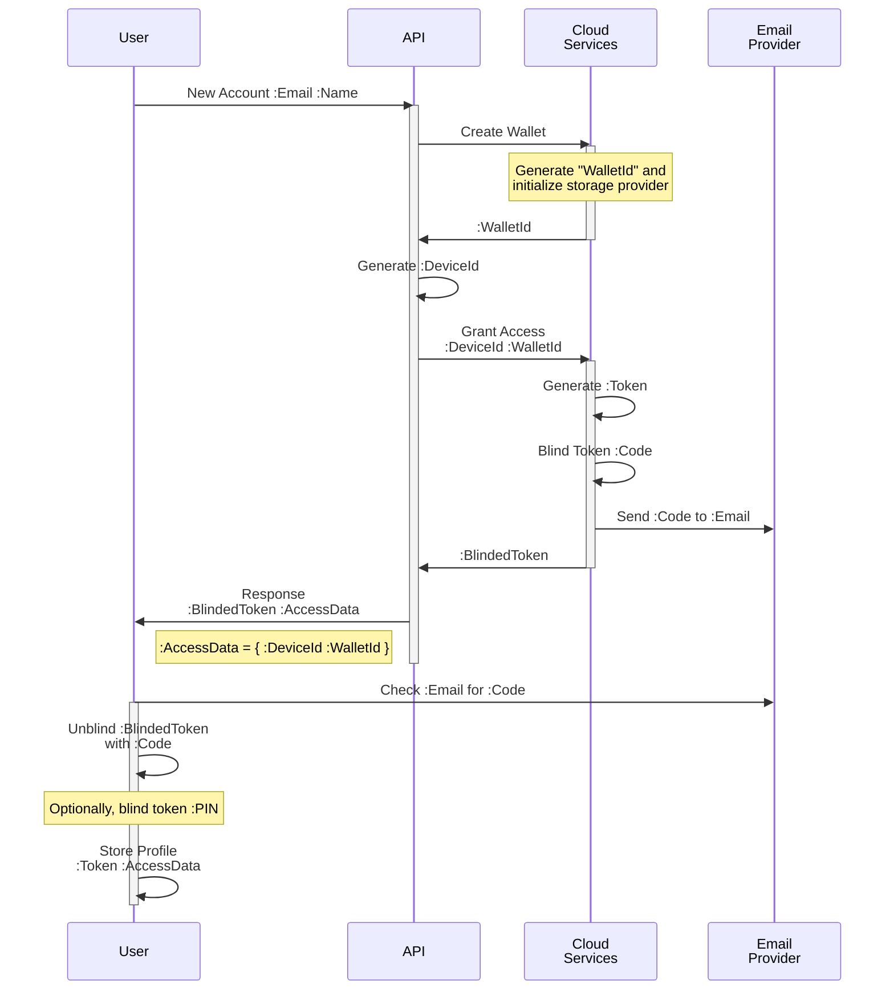

# Trinsic's Security

## Overview

## New Account Registration

```mermaid

sequenceDiagram

    participant U as User
    participant A as API
    participant S as Cloud<br/>Services
    participant E as Email<br/>Provider
    
    U->>A: New Account :Email :Name

    activate A
    A->>S: Create Wallet
    activate S
    note over S: Generate "WalletId" and<br/>initialize storage provider
    S->>A: :WalletId
    deactivate S
    
    A->>A: Generate :DeviceId
    A->>S: Grant Access<br/>:DeviceId :WalletId

    activate S
    S->>S: Generate :Token
    S->>S: Blind Token :Code
    S->>E: Send :Code to :Email
    S->>A: :BlindedToken
    deactivate S
    
    A->>U: Response<br/>:BlindedToken :AccessData
    note right of U: :AccessData = { :DeviceId :WalletId }
    deactivate A
    
    U->>E: Check :Email for :Code
    activate U
    U->>U: Unblind :BlindedToken<br/>with :Code
    note over U: Optionally, blind token :PIN
    U->>U: Store Profile<br/>:Token :AccessData
    deactivate U

```

## Authenticated Requests