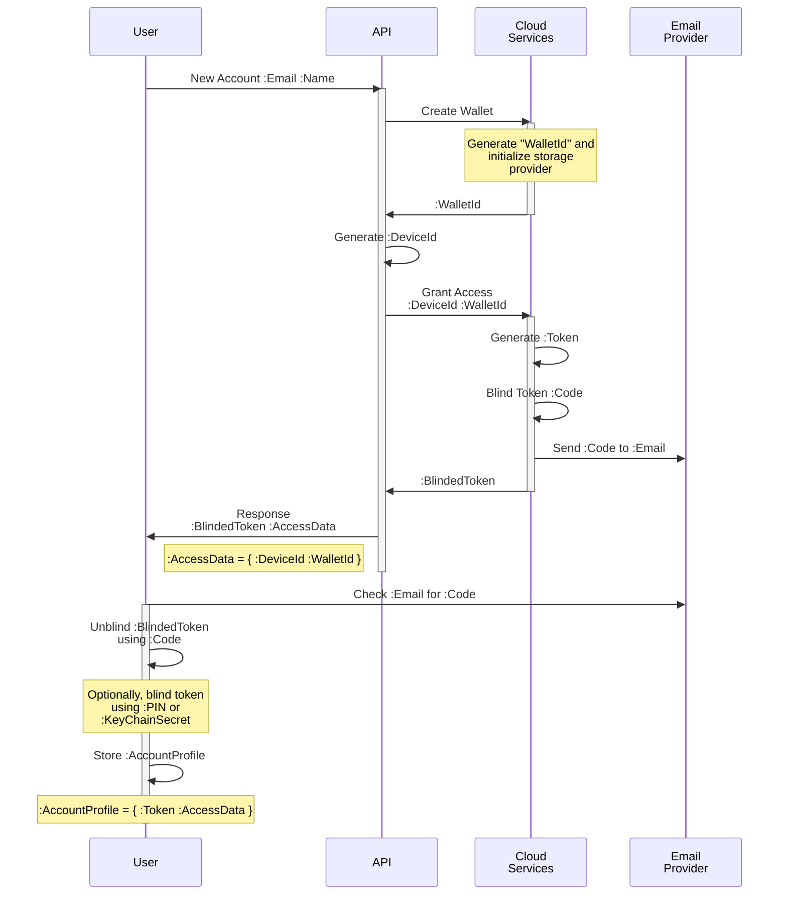
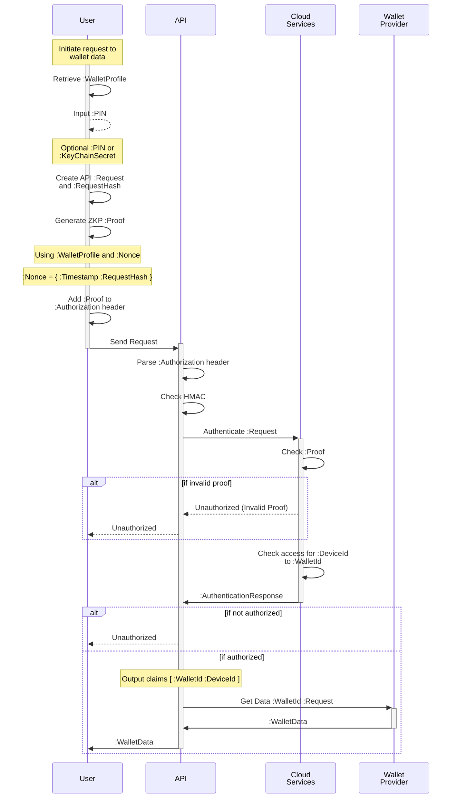

# Trinsic's Security

## Overview

We've implemented a multi-factor authentication protocol to gate access to each identity wallet.

The executive summary is as follows:
> "Oberon allows endpoints to issue multi-factor capable tokens to consumers who can prove their validity without disclosing the tokens themselves and without requiring email, SMS, or authenticator apps. Endpoints only need to store a single public key and not any tokens. An attacker that breaks into the server doesn't have any password/token files to steal and only would see a public key."

Sign in
- Sign in from any device, and confirm your sign in request from another device

Info
- Get account information 

List Devices
- List all the devices that are currently authenticated

Revoke Device
- Revoke a device

## Zero-knowledge Security Architecture

Because the tokens are blinded, Trinsic does not know which identities are accessing which wallets.  

We call this zero knowledge because
- Each API request is blinded
- No private keys are stored on our servers. If a hacker breaks in, they will only find the public key
- Each API call is authenticated, regardless of where it's coming from, leading to a true zero trust architecture.
- verifies device identity and user identity. Logins and connections time out once established, forcing users to continuously re-verify
- Ensures each device is authorized in addition to each user
- Multi factor authentication by default

Trinsic supports networks of complex interactions between different services.

## New Account Registration

## Authenticated Requests

