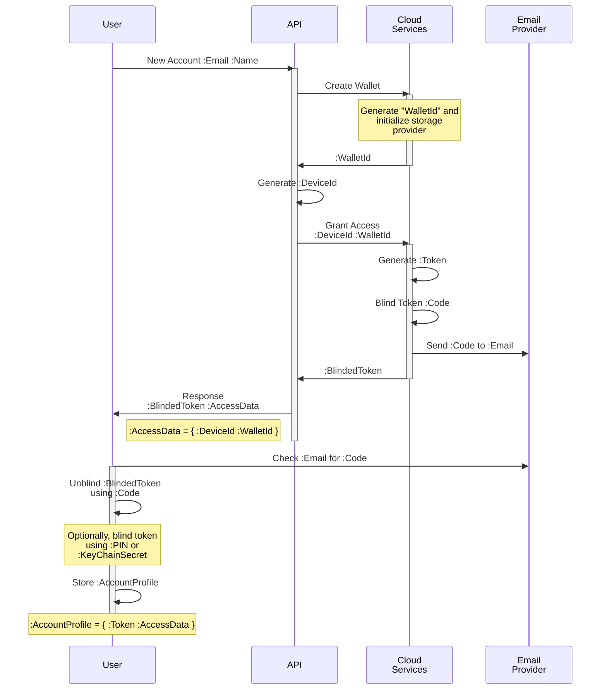
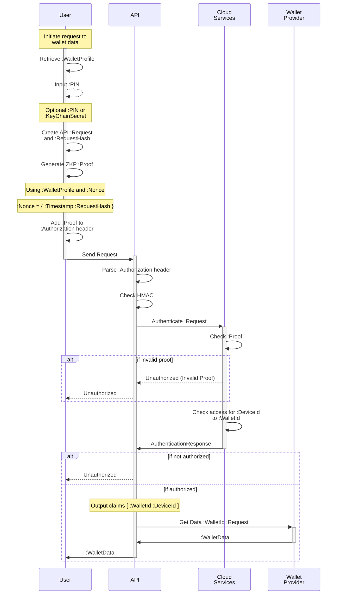

# Trinsic's Security

## Overview

TODO

## Zero-knowledge Security Architecture

TODO

## New Account Registration

```mermaid

sequenceDiagram

    participant U as User
    participant A as API
    participant S as Cloud<br/>Services
    participant E as Email<br/>Provider
    
    U->>A: New Account :Email :Name

    activate A
    A->>S: Create Wallet
    activate S
    note over S: Generate "WalletId" and<br/>initialize storage<br/>provider
    S->>A: :WalletId
    deactivate S
    
    A->>A: Generate :DeviceId
    A->>S: Grant Access<br/>:DeviceId :WalletId

    activate S
    S->>S: Generate :Token
    S->>S: Blind Token :Code
    S->>E: Send :Code to :Email
    S->>A: :BlindedToken
    deactivate S

    A->>U: Response<br/>:BlindedToken :AccessData
    note right of U: :AccessData = { :DeviceId :WalletId }
    deactivate A

    U->>E: Check :Email for :Code
    activate U
    U->>U: Unblind :BlindedToken<br/>using :Code
    note over U: Optionally, blind token<br />using :PIN or<br/>:KeyChainSecret
    U->>U: Store :AccountProfile
    note over U: :AccountProfile = { :Token :AccessData }
    deactivate U

```

## Authenticated Requests

```mermaid

sequenceDiagram

    participant U as User
    participant A as API
    participant S as Cloud<br/>Services
    participant W as Wallet<br/>Provider

    note over U: Initiate request to<br/>wallet data
    activate U
    U->>U: Retrieve :WalletProfile
    U-->>U: Input :PIN
    note over U: Optional :PIN or<br/>:KeyChainSecret
    U->>U: Create API :Request<br/>and :RequestHash
    U->>U: Generate ZKP :Proof
    note over U: Using :WalletProfile and :Nonce
    note over U: :Nonce = { :Timestamp :RequestHash }
    U->>U: Add :Proof to<br/>:Authorization header
    U->>+A: Send Request
    deactivate U

    A->>A: Parse :Authorization header
    A->>A: Check HMAC

    A->>+S: Authenticate :Request
    S->>S: Check :Proof
    alt if invalid proof
        S-->>A: Unauthorized (Invalid Proof)
        A-->>U: Unauthorized
    end
    S->>S: Check access for :DeviceId<br/>to :WalletId
    S->>-A: :AuthenticationResponse

    alt if not authorized
        A-->>U: Unauthorized
    else if authorized
        note over A: Output claims [ :WalletId :DeviceId ]
        A->>+W: Get Data :WalletId :Request
        W->>-A: :WalletData
        A->>-U: :WalletData
    end
```
