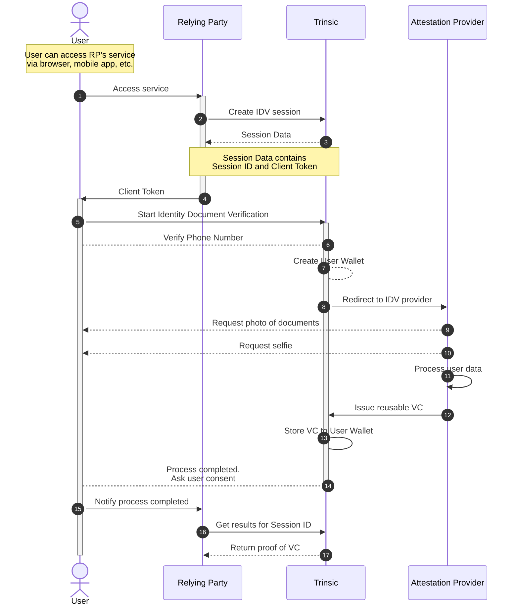
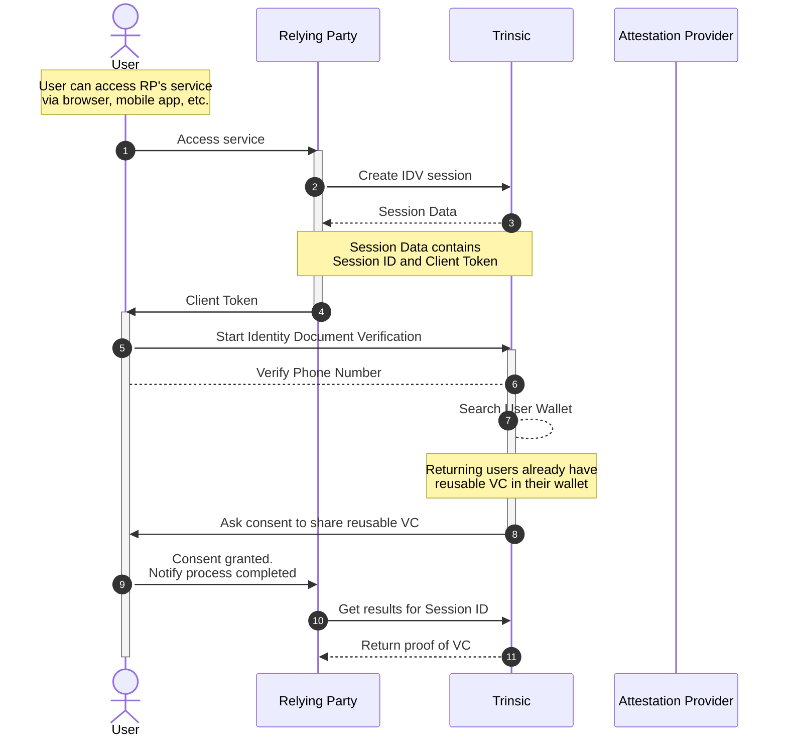

# Trinsic Connect

## What is Trinsic Connect?

*Overview*

Unleash the power of reusable ID verification. Say goodbye to repeated verification hassles. Verify once, use endlessly.

*Features*

1. One-and-Done Verification: Send users through our thorough document verification process just once.
1. Unlimited Reusability: Once verified, the user's credentials are ready to be reused anywhere, anytime.
1. Seamless Integration: Compatible with both web and mobile apps. Get up and running in minutes.
1. Brand-Friendly: Tailor the look and feel to match your brand's vibe. Keep the experience consistent.

## First-time document verification flow

This diagram describes the sequence of interactions during which the user submits their ID documents for verification and receives a resuable Verifiable Credential in their wallet.

## Returning user flow

This diagram describes the sequence of interactions when the user already has a reusable VC in their wallet and is asked to share it with the Relying Party.

## How to integrate?
