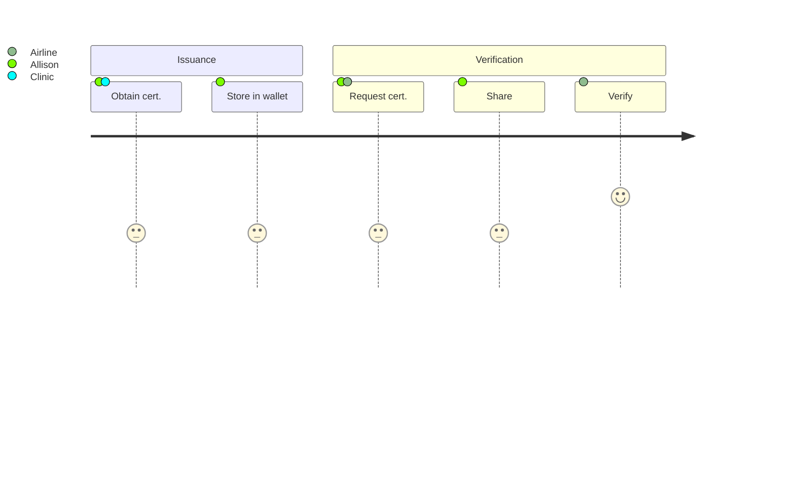

## Use case overview

In this walkthrough we'll explore a scenario where Allison gets her vaccination certificate. She then uses this certificate to board an airline that requires proof of vaccination. Each participant in this scenario is part of the same ecosystem, though this is not a functional requirement.

If you haven't learned about verifiable credentials already, first read [Verifiable Credential Basics](https://docs-v2.trinsic.id/learn/credentials).

In most credential exchange scenarios there are three primary roles - Issuer, Holder, and Verifier.

**Issuer**: Responsible for issuing signed credentials that attest information about a credential subject

**Holder**: Stores issued credentials from an issuer. Most often this is the credential subject. Also generates passes to share with verifiers.

**Verifier**: Verifies passes presented from holders.
