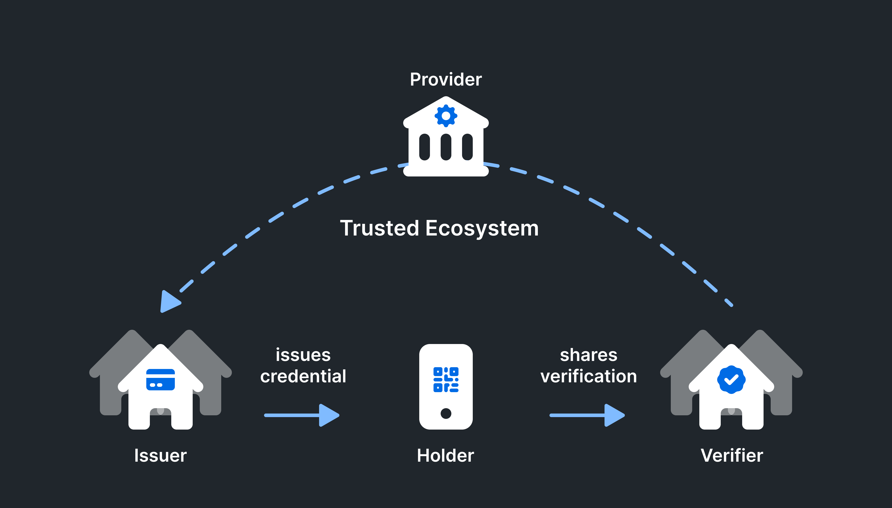
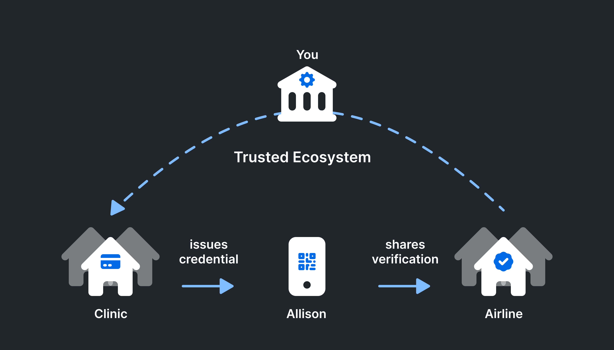

# Walkthrough
It can be challenging to understand how verifiable credentials work until you see some examples. This walkthrough will show how a vaccination card might be issued, held, and proven using verifiable credentials with Trinsic. It assumes no prior knowledge to decentralized identity. 
 
## Prerequisites
Before you begin, you'll need to be a early adopter of Trinsic Ecosystems to have the fully-functional platform. The instructions assume you have already set up your ecosystem deployment.

If you haven't been invited to Trinsic Ecosystems yet, please [get in touch](https://trinsic.id/contact-us/) or [learn more](https://trinsic.id/trinsic-ecosystems/)! We'd love to help you get started. 
## Install Trinsic
If you are ready to begin integrating the SDK into an existing project, make sure you have an SDK installed.
We currently provide a CLI, TypeScript, and C# SDKs for local development.

If you're here to just go through the walkthrough, check out our [Gitpod cloud environment](https://gitpod.io/#https://github.com/trinsic-id/sdk) for easy installation (You'll have to create a free account with gitpod). 

=== "Trinsic CLI"

    --8<-- "reference/installation/install-cli.md"

=== "TypeScript"

    --8<-- "reference/installation/install-node.md"

=== "C#"

    --8<-- "reference/installation/install-net.md"

Once installed, configure the SDK's server address to your Ecosystem:

=== "Trinsic CLI"

    ```bash
    trinsic config --server-address https://example.com
    ```

=== "TypeScript"

    ```js
    import { WalletService } from '@trinsic/trinsic';

    // Set the server address
    const service = new WalletService("https://example.com");

    ```

=== "C#"

    ```csharp
    using Trinsic;

    // Set the server address
    var service = new WalletService("https://example.com");
    ```

Reference: [Configuration](reference/configuration.md)
---


## Meet Allison
Allison's town just received the go ahead to vaccinate everyone. 
We'll walk through a scenario where Allison gets her vaccination card and then generates a pass with it to board an airline, all using her devices.

## Brief Tech Explainer
If you haven't learned about verifiable credentials already, first read [Verifiable Credential Basic](https://trinsic.id/trinsic-basics-the-verifiable-credentials-model/).


In most credential exchange scenarios there are three primary roles - Issuer, Holder, and Verifier. 

**Issuer**: Responsible for issuing signed credentials that attest information about a credential subject

**Holder**: Stores issued credentials from an issuer. Most often this is the credential subject. Also generates passes to share with verifiers.

**Verifier**: Verifies passes presented from holders. 

<!-- There are also two parties who are not talked that provide the human layer of trust. A governance authority defines the credential and pass templates.

**Governance Authority** - todo 

**Ecosystem Provider** -  -->

## 1. Create Wallets
We'll start by creating a wallet for each participant in this credential exchange. Wallets can be created by anyone, for anyone. In this scenario, we have three wallets. Allison will be the credential holder, the Airline will be the verifier, and the vaccination clinic will be the issuer.

These wallets have been created by you, your role is an ecosystem provider. Your role is to help deploy a credential exchange ecosystem. 



=== "Trinsic CLI"

    ```bash
    trinsic wallet create --description "Allison's Wallet" --name allison && \
    trinsic wallet create --description "Airline's wallet" --name airline && \
    trinsic wallet create --description "Vaccination Clinic" --name clinic
    ```

=== "TypeScript"

    ```js
    coming soon
    ```

=== "C#"

    ```csharp
    var providerProfile = await walletService.CreateWallet(); 
    providerService.SetProfile(providerProfile);
    ```

!!! note
    Reference: [Create Wallet](reference/services/wallet-service.md#create-wallet)
--- 


## 2. Issue a Credential
Each credential is a JSON-LD document that is signed with a special digital signature to makes each piece of data in the credential separately verifiable. This is a called bbs+ signature scheme. 
The credential is signed, but not sent. For now, sending the credential should be done through existing communication methods. 

=== "Trinsic CLI"

    ```bash
    trinsic --profile clinic issuer issue --document ./covid-vocab/vaccination-certificate-unsigned.jsonld --out ./vaccination-certificate-signed.jsonld
    ```
=== "TypeScript"

    ```js
    coming soon
    ```

=== "C#"

    ```csharp
    var unsignedDocument = new JObject
    {
        { "@context", "https://w3id.org/security/v3-unstable" },
        { "id", "https://issuer.oidp.uscis.gov/credentials/83627465" }
    };

    var issueResponse = await walletService.IssueCredential(unsignedDocument);
    ```
!!! info
    Reference: [Issue a Credential](reference/services/wallet-service.md#issue-credential)

---

## 3. Store Credential in Wallet

Once Allison receives the credential, she can store it within her wallet. She can use any device that she's authorized to use with her wallet. 


=== "Trinsic CLI"

    ```bash
    trinsic --profile allison wallet insert-item --item ./vaccination-certificate-signed.jsonld

    ```

=== "TypeScript"

    ```js
    coming soon
    ```

=== "C#"

    ```csharp
    var itemId = await walletService.InsertItem(issueResponse);
    ```

Note down the response `item_id` for the next step.

!!! info
    Reference: [Insert Record](reference/services/wallet-service.md#insert-record)
---

## 4. Create Proof

Replace the `<item_id>` in the command bellow with the output from the `insert_item` above.

=== "Trinsic CLI"

    ```bash
    trinsic --profile allison issuer create-proof --document-id <item_id> --out ./vaccination-certificate-partial-proof.jsonld --reveal-document ./covid-vocab/vaccination-certificate-frame.jsonld
    ```

=== "TypeScript"

    ```js
    coming soon
    ```

=== "C#"

    ```csharp
    var proof = await walletService.CreateProof(itemId, new JObject { { "@context", "https://w3id.org/security/v3-unstable" } });
    ```
The proof is sent to the verifying party via DIDComm, OIDC, email, etc. For this demo, it will be considered out-of-band.

!!! info
    Reference: [Create Proof](reference/services/wallet-service.md#create-proof)

---

## 5. Verify Proof

=== "Trinsic CLI"

    ```bash
    trinsic --profile airline issuer verify-proof --proof-document ./vaccination-certificate-partial-proof.jsonld
    ```

=== "TypeScript"

    ```js
    coming soon
    ```

=== "C#"

    ```csharp
    var valid = await walletService.VerifyProof(proof);
    ```

Watch for the output of `true` to know that the credential successfully passed all of the verification processes.
!!! info
    Reference: [Verify Proof](reference/services/wallet-service.md#verify-proof)
