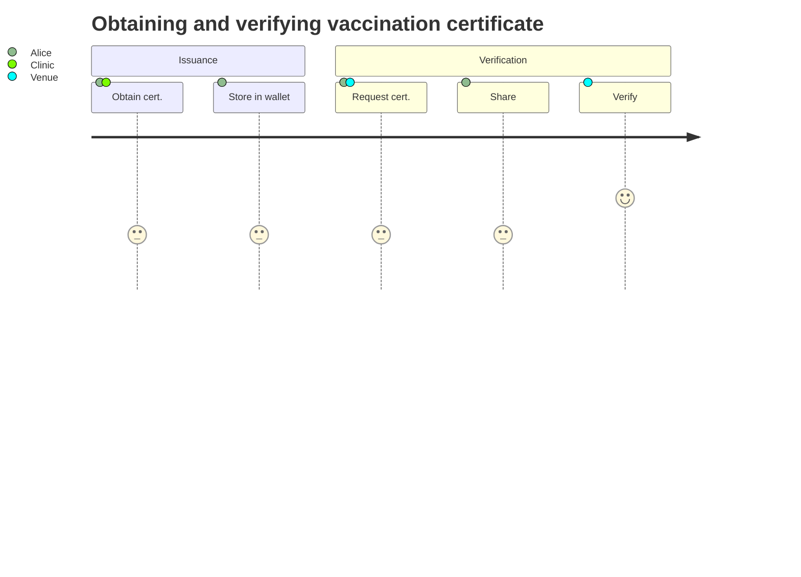

In this walkthrough we will showcase a practical example of how participants in an ecosystem use verifiable data to exchange trusted bits of information.

Before we begin, please ensure that you have a running ecosystems infrastructure. If you haven't yet, [join our early adopter program](/early-adopter.md) to have your own dedicated ecosystem infrastructure setup.
Once your infrastructure is up, you will have received an endpoint to connect to your cloud service.

