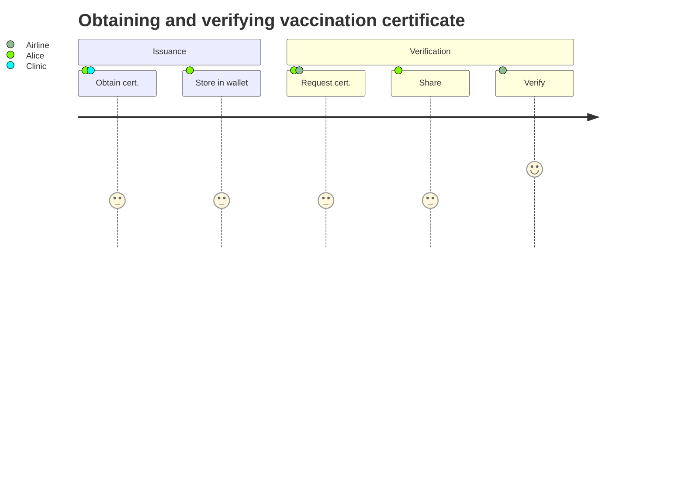

## Use case overview

In this walkthrough we'll explore a scenario where Allison gets her vaccination certificate. She then uses this certificate to board an airline that requires proof of vaccination. Each participant in this scenario is part of the same ecosystem, though this is not a functional requirement.

